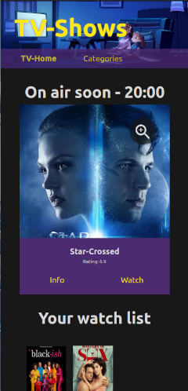
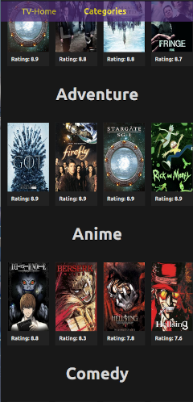
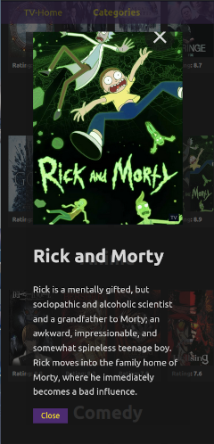

# Vue-assessment project


## Introduction
I have the latest version of Vue 3 installed, with the default Vue introductory views and components.
Just to see what the latest Vue version is all about.
I see the default implementation of Typescript, Vite and Teleport.
The _Vite_ environment is new to me, but I don't think it will be a problem.

I uses 'Timeboxes' to build required functionality. So I meet the minimal requirements.
And improve this as time goes on.

I also add _todo_ comments in the code.
Identifying aspects I need to work on, but only when I have time.

## Project configuration

### Prerequisites
* Git
* Node.js 16.X

### Clone the repository, install, and run project for development

```sh
git clone https://github.com/xxx/xx.git
cd xxx
npm install
npm run dev
```

## Implementation

### UI/UX

I try to keep it simple, by introducing a homepage with an overview of TV show(s) that are currently or soon to be broadcast.
This could be expanded with favorite shows, etc.  
I've added an overlay dialog with details about a TV show. That is a reusable part. Also used on the category page. Using the vue **Teleport** functionality.

# Vue DEV_OPS

Mostly out of the box (vue) commands.

## Recommended IDE Setup

[VSCode](https://code.visualstudio.com/) + [Volar](https://marketplace.visualstudio.com/items?itemName=Vue.volar) (and disable Vetur) + [TypeScript Vue Plugin (Volar)](https://marketplace.visualstudio.com/items?itemName=Vue.vscode-typescript-vue-plugin).

## Type Support for `.vue` Imports in TS

TypeScript cannot handle type information for `.vue` imports by default, so we replace the `tsc` CLI with `vue-tsc` for type checking. In editors, we need [TypeScript Vue Plugin (Volar)](https://marketplace.visualstudio.com/items?itemName=Vue.vscode-typescript-vue-plugin) to make the TypeScript language service aware of `.vue` types.

### Compile and Hot-Reload for Development

```sh
npm run dev
```

### Type-Check, Compile and Minify for Production

**This didn't work for me on my Ubuntu system!****  
Got error _"[vite:import-glob] EACCES: permission denied, scandir '/lost+found'"_.
Probable `scandir` need root priviledges.  
But I don't want to try to fix this, potentially compromising ongoing projects.
It doesn't block development!
```sh
npm run build
```

### Run Unit Tests with [Vitest](https://vitest.dev/)

```sh
npm run test:unit
```

### Run End-to-End Tests with [Cypress](https://www.cypress.io/)

A different approach, because my `build` doesn't work.  
Start the DEV-server and then the Cypress UI.
```sh
npm run dev | npx cypress open --config baseUrl=http://localhost:5173
```
Navigate thruogh the inteface provided:
* Select "E2E-Testing"
* Press "Start E2E Testing in Electron"
* Run "01-Homepage"

Original process when `build` works, which didn't on my Ubuntu system.  
```sh
npm run build
npm run test:e2e # or `npm run test:e2e:ci` for headless testing
```

Didn't have time to use the Cypress Beta Component test suite.

### Lint with [ESLint](https://eslint.org/)

```sh
npm run lint
```
# Examples 'Dark mode'

Home | Details | Category
--- | --- | ---
 | | 
